# Ternary Traveler

Created: 02-13-2020 14:10:46 | Modified: 02-13-2020 16:43:52

*This assignment is an individual exercise: [Directions here](directions.md)*

Preview application here: https://trinity-ternary-traveler.netlify.com/

***

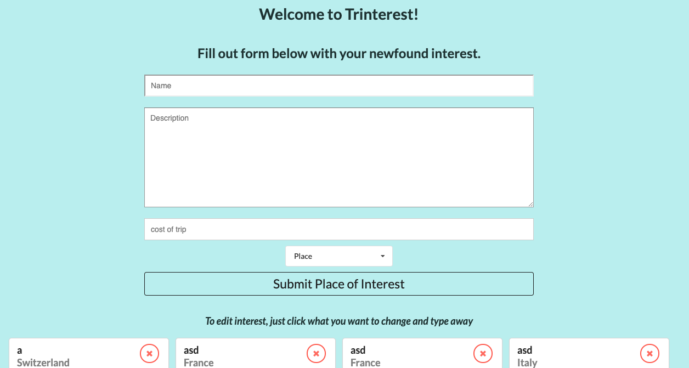
*Page on Load*

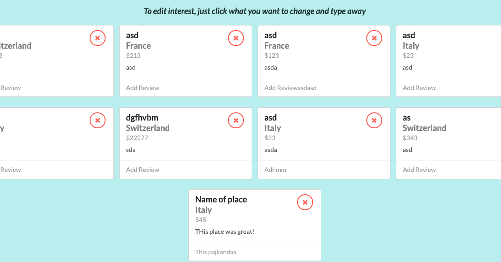
*Cards*

## Description
### This assignment allows user to track places of interest by inputing information in a form and reading past posts below the form in card form. 
***
***
## Features
### An alert pops up when user tries to delete card to verify user actually wants to delete it.
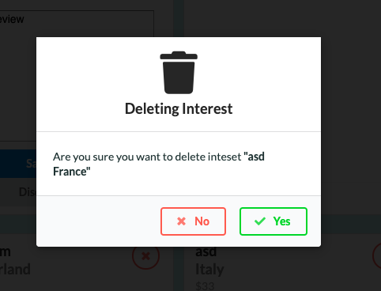
*Alert on Delete*
***
### An alert pops up if user is editing a card and tried to edit another card. This keeps user from editing multiple things at once.
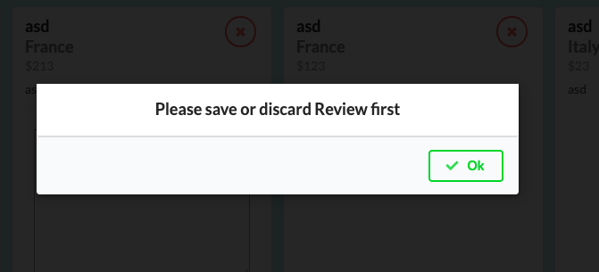
***
### An alert pops up of user tries to submit form with invald input
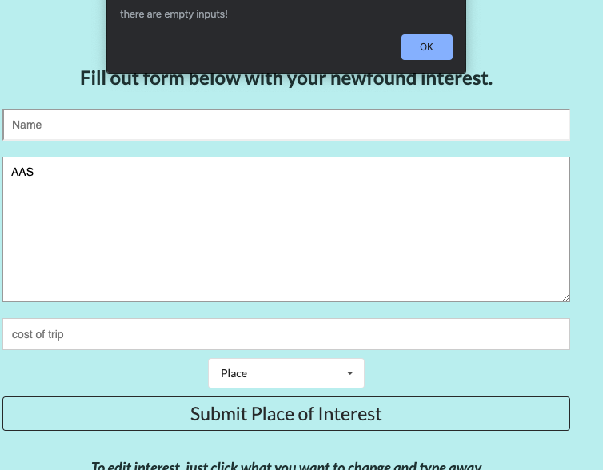
***
### User can only type numbers for cost
***
### Places are populated by database
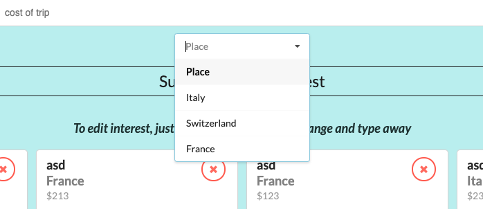
*Input form dropdown for Places*
***
### User can edit each part of card individually by clicking on element.
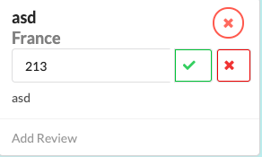
*Editing Cost after submit*

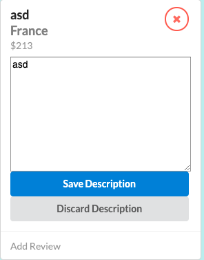
*Editing Description after submit*

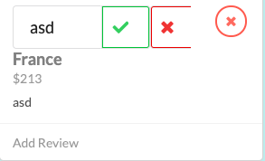
*Editing Name after submit*

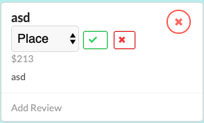
*Editing Place after submit*

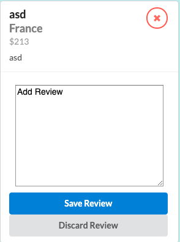
*Adding Review*
